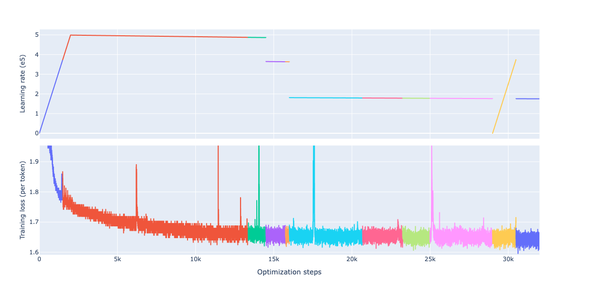
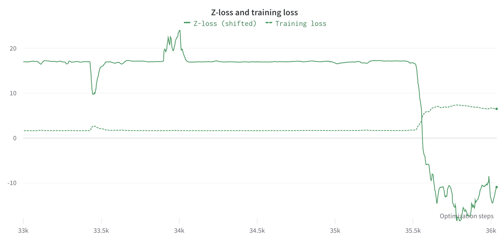
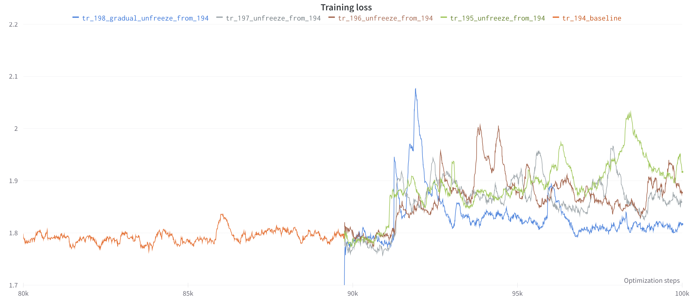
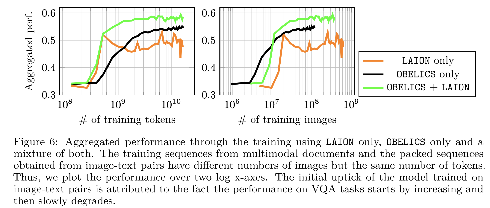
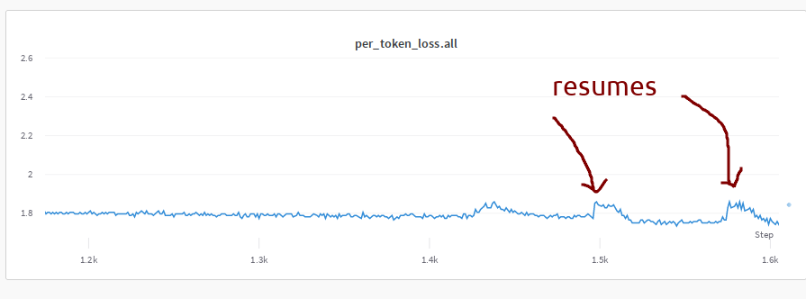
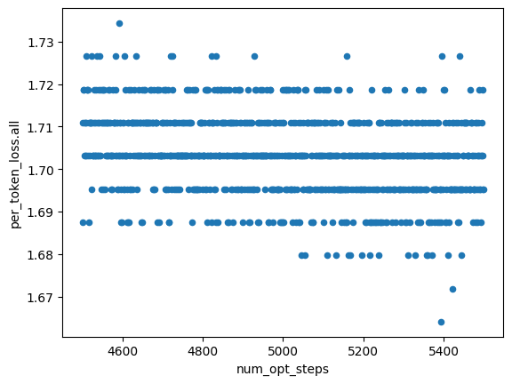

# Knowledge sharing memo

We reproduced [Flamingo](https://huggingface.co/papers/2204.14198), an 80 billion parameters vision and language model developed by Deepmind. Similarly to GPT-4, the model accepts arbitrary sequences of image and text as inputs and generates text outputs.

This knowledge-sharing memo follows [a previous one](https://docs.google.com/document/d/1ZNGyVWYFUbzV0xuei4SED2QAakGjMpaaQALcKYQm46U) we shared a few months ago which was mainly focused on lessons we learned from stabilizing our training at medium scale.
In this second memo, we try to capture lessons from scaling to 80 billion parameters and training the model, mistakes we've made, and remaining open questions. This is not meant to be exhaustive, nor chronological, but presents a snapshot of our take-aways while laying the ground for the next steps. We suspect that some of the mistakes and difficulties we encountered limited the performance we reached.

Our 80 billion parameters model called [IDEFICS](https://huggingface.co/HuggingFaceM4/idefics-80b), is on par with the original closed-source Flamingo, and is built solely on top of openly accessible models and data. You can play with IDEFICS on the [demo](https://huggingface.co/spaces/HuggingFaceM4/idefics_playground). For more details about the model itself, its performance and construction, we refer to the [model card](https://huggingface.co/HuggingFaceM4/idefics-80b).

## The rollercoaster of training an 80 billion parameters

When we scaled to 80 billion parameters, we ran into several loss spikes during the training. Some of these spikes rapidly recovered to the original loss level and some others diverged and never recovered.

To stabilize and continue the training, we used a combination of:
- rollback: re-start from a checkpoint a few hundred steps prior to the spike/divergence
- rollback + learning rate decrease: as above plus lower the maximum learning rate

Each time we rollback, given the implementation of data loading in [WebDataset](https://github.com/webdataset/webdataset), we do not preserve the data order.

To minimize the amount of compute "wasted" due to rollbacks, we saved checkpoints every 250 steps (i.e., approximately every 3 hours).



The plot above shows the training loss and learning rate at each step resulting from the successive rollbacks (i.e., the divergences are not shown). We performed 11 rollbacks (and sometimes learning rate decrease) to obtain the released checkpoint. At step 29'000, motivated by the possibility that the model was stuck in a local optimum, we tried *increasing* the learning rate. That turned out to be an unsuccessful attempt, and in the interest of not losing an additional full day of compute, we decided to simply continue the training by going back to the previous learning rate schedule.

For more exhaustive details and graphs, including plots of the individual spikes that did not recover, follow the journey in the [chronicles](../tr-190-80b/chronicles.md)!


## Unresolved questions that are likely impacting end performance

### Loss spikes and z-loss, are you in a relationship?

We followed recommendations from [PaLM](https://huggingface.co/papers/2204.02311) and added the *auxiliary z-loss*. In short, the z-loss prevents the logits from drifting too far from 0, which can cause unacceptable roundoff errors in bf16, and encourages the logits to be normalized log probabilities. This auxiliary penalty was found to increase training stability.
```
log_z = torch.logsumexp(logits, dim=-1)
z_loss = log_z**2
loss += penalty_weight * z_loss
```
We performed grid-search hyper-parameter-tuning on the weight of the penalty at the 9 billion scale, and saw neither training instabilities nor major differences in downstream performance. We thus decided to keep the z-loss, and chose a weight value relatively close to the value reported in the paper.

However, when training IDEFICS-80B, we noticed that the spikes in the training loss often co-occurred with negative spikes in the auxiliary loss, although not systematically.



A sudden decrease of the z-loss indicates a sudden collapse of the logits. Yet, we are unsure whether the spike is causing the collapse or vice-versa, or whether another underlying mechanism is at play. The consistency of that phenomenon throughout the training makes us question the use of the z-loss. We leave this investigation for future work.

### To unfreeze or not to unfreeze

We followed the adaptation procedure described in the original Flamingo paper and froze the language and vision pre-trained backbones. Ablations in the paper (Table 3 and 10) show that unfreezing both backbones hurt downstream performance.

While training IDEFICS-80B, we observed that the average training loss was plateauing (or at least decreasing extremely slowly) after ~15'000 steps (see the first plot). In particular, image-text pairs were mostly driving the (very slow) decrease while the loss was plateauing on multimodal web documents instances. In parallel, neither the downstream evaluations were making significant progress, nor the qualitative generations through training. Similar observations have been made in [BLIP-2](https://huggingface.co/papers/2301.12597) and [OpenFlamingo](https://huggingface.co/papers/2308.01390). We tracked validation performance throughout the training, and decided to stop the training after 39'000 steps since the model was not making much progress. Note that the model hasn't gone through one full epoch over the dataset when the training stopped.

Additionally, a quick experiment showed that the training loss would also decrease without access to the image (we 0-ed out the image cross-attention but not the additional MLP). So part of the loss decrease on image-text pairs is driven by the model fitting the style of the captions, not by being increasingly grounded on the image.

We experimented with unfreezing additional parts of the model (the language model, the vision encoder, or both) in this plateauing zone. Surprisingly, giving more capacity to the model did not yield improvements in the training loss, neither on its dynamic (pace of decrease), nor its level (lower loss). On the contrary, all early experiments showed a similar behavior: the loss plateaus at a slightly higher level, while the baseline with frozen parts continues plateauing.



This contradicts the common intuition that models with more capacity learn faster and with less samples. Subsequent experiments with *Supervised Fine-Tuning* (SFT) where we unfroze all the pre-trained parameters confirmed once again that trend: the losses of image-text pairs and multimodal web documents were plateuing. However, we noticed that the losses on the additional datasets used for SFT were decreasing at a normal pace, while the downstream performance was increasing.

### Multimodal web documents

In our paper describing the creation of [OBELICS](https://huggingface.co/datasets/HuggingFaceM4/OBELICS), an open, massive and curated collection of interleaved image-text web documents, we show that vision and language models trained on our multimodal web documents outperform the same models trained on image-text pairs on various multimodal benchmarks. Training on multimodal web documents allows reaching the same performance using an order of magnitude fewer images than training on image-text pairs, even though the images from the two datasets come from Common Crawl. This underlines the beneft of having longer text contexts for training multimodal models. Moreover, the model trained on multimodal web documents performs better on average than models trained image-text pairs. This is particularly striking on visual question-answering benchmarks on which the model trained on image-text pairs slowly degrades through the training. These observations align with the ablations in the Flamingo paper.



We note, however, that the model trained on image-text pairs has a slight advantage performance-wise in captioning, classifcation, and OCR tasks (see [paper](https://huggingface.co/papers/2306.16527) for more details). We hypothesize that this is due to the nature of image-text pairs: captions can be seen as fuzzy class labels. While our experiments show that combining the two types of data is beneficial on average. Understanding what types of data contributes the most to teaching the model certain capabilities (OCR, visual reasoning, etc.) is an interesting scientific question. Multimodal web documents have weaker "alignment" between the text and the images than image-text pairs, however captions in image-text pairs are often non-grammatical and short. Highlighting how these properties relate to identified capabilities and whether scale impacts these insights would help being more intentional about data curation and data sourcing.


## Rethinking some of the early choices

### Filtering the long tail of documents is necessarily exponentially more costly

The steps described in the data curation and filtering process in OBELICS allowed removing a very large chunk of poor quality data. However, they turned out not to be enough, failing to capture web pages which look roughly satisfactory, but don't meet the grammar requirements of a typical English speaker as they are likely automatically generated (content farm). The [data visualization](https://atlas.nomic.ai/map/f2fba2aa-3647-4f49-a0f3-9347daeee499/ee4a84bd-f125-4bcc-a683-1b4e231cb10f) we prov ide with [Atlas](https://atlas.nomic.ai/) (a tool to visualize and interact with massive datasets) helps bringing out such data quality issues.


Given, the frequency of the spikes during the training, we suspect that having more costly (yet higher-recall) filtering methods would have been beneficial for training stability. For instance, we could use an [OpenFlamingo-3B](https://huggingface.co/openflamingo/OpenFlamingo-3B-vitl-mpt1b) model to run inference on all documents of OBELICS and sub-sample documents with a higher loss.

Along with hardware errors (see the next section), we hypothesize that data quality was one of the major causes for loss spikes.

### Stronger vision encoder

In the [first knowledge memo](https://docs.google.com/document/d/1ZNGyVWYFUbzV0xuei4SED2QAakGjMpaaQALcKYQm46U), we highlighted that the choice of the language model backbone was critical for performance. In short, using a better pre-trained leads to increased performance. Similarly, we have strong evidence that the choice of pre-trained vision encoder has a critical impact on downstream performance. [PaLI](https://arxiv.org/abs/2209.06794) highlights the trade-offs in downstream performance between vision FLOPs and language FLOPs for a given FLOPs budget, and corroborates that it is possible to significantly increase the performance on vision and language tasks by simply increasing the size of the vision encoder.

We intially explored using a significantly bigger vision encoder (the biggest in open-access at that time) with [EVA-CLIP](https://huggingface.co/QuanSun/EVA-CLIP). However, we ran into training instabilities very quickly. To lower the risks associated to the change of vision encoder, we decided to continue with [laion/CLIP-ViT-H-14-laion2B-s32B-b79K](https://huggingface.co/laion/CLIP-ViT-H-14-laion2B-s32B-b79K) which we have been using until that point. We will leave that swap for future iterations and will also consider using higher resolution images.

## Mysterious hardware errors

While training, we ran into a lot of Xid 63 and 64 errors - which occur when some memory fails and the gpu wants to remap bad memory to the supplementary memory banks. The first time it runs into this issue, it generates an Xid 63, and if after a restart the same memory is hit again and it wasn't remapped this results in Xid 64. Examples:
```
Xid errors on instance: ip-26-0-146-100, Error: May 19 07:08:57 ip-26-0-146-100 kernel: [680111.646286] NVRM: Xid (PCI:0000:10:1c): 63, pid=1850, Row Remapper: New row marked for remapping, reset gpu to activate
```

```
Xid errors on instance: ip-26-0-147-135, Error: May 29 01:37:38 ip-26-0-147-135 kernel: [257087.812628] NVRM: Xid (PCI:0000:90:1c): 64, ...
```

We consulted the NVIDIA engineers and were told that these errors aren't fatal if the kernel didn't crash and thus shouldn't impact the training. However, Xid 64 errors happened a few times too close to the moment of a spike. We are currently not 100% certain how benign these errors are in practice.

Another thing we learned is that every time an AWS Sagemaker node is rebooted, all of its gpus are likely to be replaced, so we were not able to check if the remapping (which requires a reboot) happened or not.


## Quality of life improvements

### Slurm users, you should always test multithreading

The multithreading slurm parameter turned out to be very critical:
```
--hint=[no]multithread	[don't] use extra threads with in-core multi-threading
```
We inherited the habit of using multithreading from training BLOOM on [Jean Zay](http://www.idris.fr/eng/jean-zay/cpu/jean-zay-cpu-hw-eng.html). By activating multi-threading on our AWS cluster, everything was roughly 10x slower: loading the weights at the beginning of the training, the forward+backward, etc.

Talking to users from other clusters, it seems that in some cases, it makes a difference, in other cases, it does not. There are good explanations [here](https://agner.org/optimize/) and [here](https://stackoverflow.com/questions/57872223/does-the-running-of-a-second-thread-on-an-hyperthreaded-cpu-introduce-extra-over), but in short, it depends and requires benchmarking for the best outcome!

### Unbuffer logging

Just before starting the training, we discovered that our logging started to get buffered. Which meant that we couldn't see the iteration logs in real time and sometimes it'd take 10-20 minutes before the logs would appear. We narrowed it down to the `accelerate` launcher.

We wrote a simple test script:
```
$ cat test.py
import time

for i in range(10000):
    print("x"*10)
    time.sleep(2)
```
which was not logging in real time due to buffering. We noticed that when we use `python -u -m torch.distributed.run` the logging was unbuffered.

With the help of the Accelerate team we quickly found the equivalent call and replaced the launcher:
```
- accelerate launch
+ python -u -m accelerate.commands.launch
```
and voila, there was no buffering anymore.

We still don't know why it was doing unbuffered output in the first place. It's very possible that some third party module was messing with the buffering.


## A few fun facts

### Restart spikes

Each resume restart resulted in a small spike for the image-text pairs datasets, which would recover in about 50 iterations. Of course, that also impacted the averaged loss.



The cause proved to be DataLoader which was arranging data so that the `image2text` ratio (the proportion of image tokens among the sequence of text tokens) is always low on resume (due to pseudo-shuffling on the fly). As a consequence, when the ratio drops (i.e. longer captions on average), the loss increased right away, and would take a few iterations to come back to a regular level. The solution we implemented consisted of shuffling the data one more time right before yielding them to the model so that the `image2text` ratio would be more consistent throughout the training and more specifically on restarts.

### BF16 loss

It was interesting to observe that since bfloat has a low precision, the discrete loss values weren't very many



If we print out all the distinct values, we get just a few loss values:

```
perl -nle '/per_token_loss: +(.*?) \|/ && $x{$1}++; END {print join "\n", sort keys %x}' tr_190_01_64n_137703.out
1.6562
1.6641
1.6719
1.6797
1.6875
1.6953
1.7031
1.7109
1.7188
1.7266
1.7344
```
