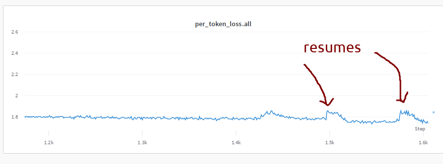
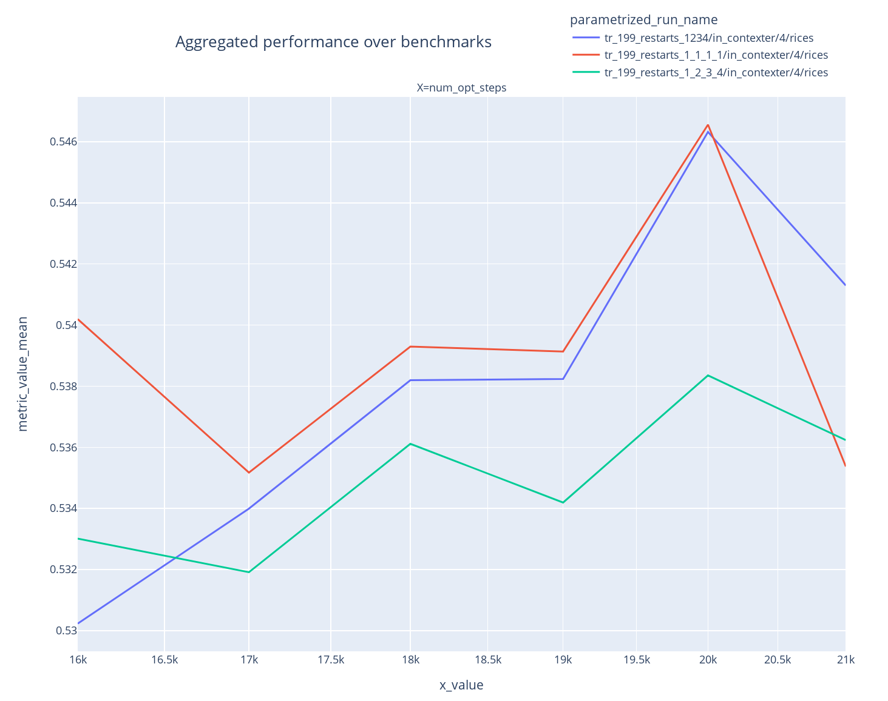
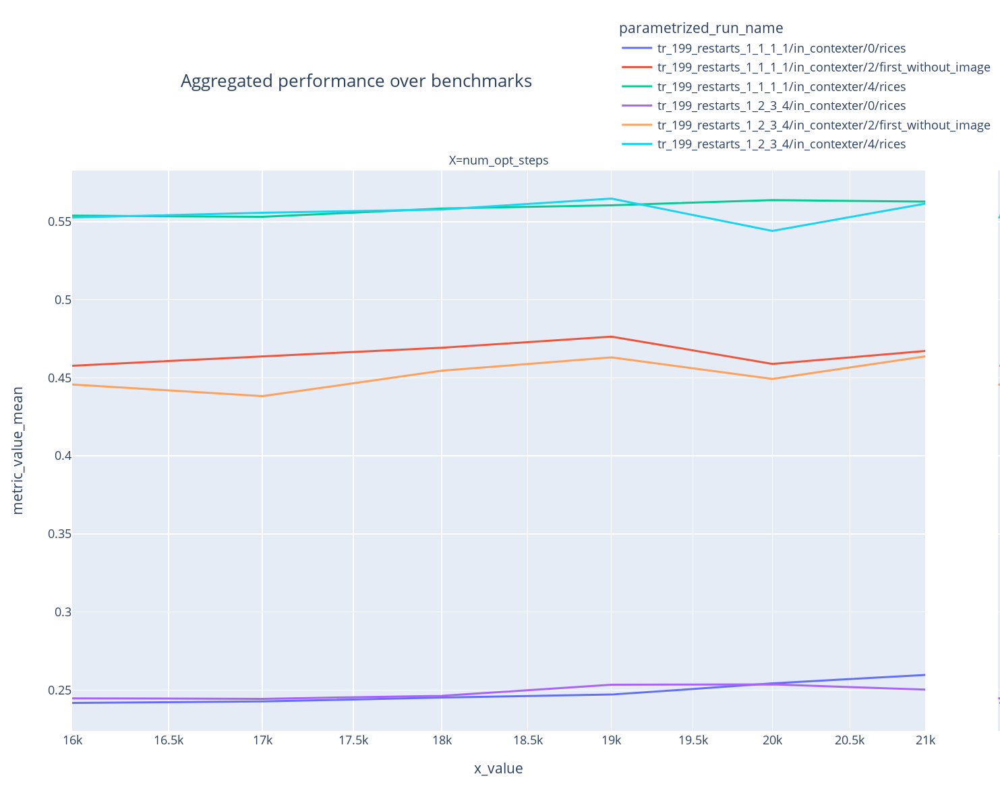

# Chronicles

m4-llama-clip-80b training started 2023-05-18 14:25 PST on 64 nodes


## Unbuffer iteration stats logging output (2023-05-18)

For some reason just before we started the training we discovered our logging started to get buffered. Which meant that we couldn't see the iteration logs in real time and sometimes it'd take 10-20min before the logs would appear.

After several hours of experiments we narrowed it down to the `accelerate` launcher. I wrote a simple test script:

```
$ cat test.py
import time

for i in range(10000):
    print("x"*10)
    time.sleep(2)
```

which was not logging in real time due to buffering. I have noticed that when I used `python -u -m torch.distributed.run` the logging was unbuffered.

So with the help of the Accelerate team we quickly found the equivalent call and replaced the launcher like so:

```
- accelerate launch
+ python -u -m accelerate.commands.launch
```
and voila, the problem went away.

We still don't know why it was doing unbuffered output with `accelerate launch` until yesterday and why it stopped. It's very possible that some third party module was messing with the buffering.


## small spikes on resume (2023-05-19)




### optimizer's step counter check

One suspect is the AdamW `step` counter which must not be reset back to `0` on resume.

Let's check it's saved:
```
$ git clone https://github.com/bigscience-workshop/Megatron-DeepSpeed
$ cd Megatron-DeepSpeed/tools/convert_checkpoint
$ python inspect_checkpoint.py $M4_FOLDER/experiments/local_experiment_dir/tr_190_01_64n-offload/opt_step-1496/accelerator_state/pytorch_model/bf16_zero_pp_rank_137_mp_rank_00_optim_states.pt | grep step
loading checkpoint file: $M4_FOLDER/experiments/local_experiment_dir/tr_190_01_64n-offload/opt_step-1496/accelerator_state/pytorch_model/bf16_zero_pp_rank_137_mp_rank_00_optim_states.pt
[tensor] optimizer_state_dict.optimizer_state_dict.state.0.step = torch.Size([])
[tensor] optimizer_state_dict.optimizer_state_dict.state.1.step = torch.Size([])
```
so we know it's there but can't see the value, so let's load it now directly:

```
$ python -c 'import torch; sd = torch.load(os.environ['M4_FOLDER'] + "/experiments/local_experiment_dir/tr_190_01_64n-offload/opt_step-1496/accelerator_state/pytorch_model/bf16_zero_pp_rank_137_mp_rank_00_optim_states.pt", map_location=torch.device("cpu")); print(sd["optimizer_state_dict"]["optimizer_state_dict"]["state"][1]["step"])'
tensor(1497.)
```

The `step` value checks out - that is it gets saved.

Now check the next checkpoint to see that it's 1500

```
$ python -c 'import torch; sd = torch.load(os.environ['M4_FOLDER'] + "/experiments/local_experiment_dir/tr_190_01_64n/opt_step-1500/accelerator_state/pytorch_model/bf16_zero_pp_rank_137_mp_rank_00_optim_states.pt", map_location=torch.device("cpu")); print(sd["optimizer_state_dict"]["optimizer_state_dict"]["state"][1]["step"])'
tensor(1501.)
```

all looks good wrt `step` so it must be something else.


### gpu corrupting memory in the saved checkpoint?

The reason we forced a restart is that one of the GPUs reported:

```
Xid errors on instance: ip-26-0-146-100, Error: May 19 07:08:57 ip-26-0-146-100 kernel: [680111.646286] NVRM: Xid (PCI:0000:10:1c): 63, pid=1850, Row Remapper: New row marked for remapping, reset gpu to activate
```

So another hypotheses was that perhaps some memory was getting corrupted when the checkpoint was saved. Therefore we removed that bad node, trained for a bit for the loss spike to recover, save the checkpoint and resume again to see if the small spike will go away this time.

But the small spike was still there on resume, so it wasn't it either.

Some state doesn't get saved/restored on resume.

### rollback

Meanwhile we did a few more restarts and it kept on happening so we decided for now to rollback to 1496, to minimize disturbances while we are investigating things, since w/o resume everything works fine.


### resume spikes

The cause proved to be DataLoader which was arranging data so that `image2text` ratio is always low on resume - so when the ratio drops, the loss increases right away, and takes a bit of time to recover.


work was done to make the ratio more consistent, but the effect still remained for future resumes.


## bfloat impact on loss values

It's interesting to observe that since bfloat has low precision the loss values are not very many


e.g. we print out all the distinct values we get just a few loss values:

```
perl -nle '/per_token_loss: +(.*?) \|/ && $x{$1}++; END {print join "\n", sort keys %x}' tr_190_01_64n_137703.out
1.6562
1.6641
1.6719
1.6797
1.6875
1.6953
1.7031
1.7109
1.7188
1.7266
1.7344
```


## diverging spike exp1 (2023-05-26)


We had a series of spikes which were gradually going into divergence.


We decided to rollback to 15611 and restart

At this point we still weren't sure if Xid 64 was a problem, but restarting removed that bad node from our training. So we haven't changed any hyper params at this point, hoping that the cause of the problem was hardware issues.


## diverging spike exp2 (2023-05-27)

It looks like we didn't rollback enough, and the divergence happened again:


Restarted after a rollback to 14500 (before the large spike) and reduced the LR by 25%.


## Xid 64 exp3 (2023-05-28)

Getting Xid 64 again - the bad node wasn't removed from the pool

```
Xid errors on instance: ip-26-0-147-135, Error: May 29 01:37:38 ip-26-0-147-135 kernel: [257087.812628] NVRM: Xid (PCI:0000:90:1c): 64, ...
```

This is when the Xid 64 happened, and things went south from there:


Rolled back to 16250 (the last checkpoint just before the error was reported) and restarted

Xid Errors:

63: ECC page retirement or row remapping recording event
64: ECC page retirement or row remapper recording failure


## divergence exp4 (2023-05-29)

We are diverging still:


The total trainable grads are spiking:


Rolled back to 16250 while reducing the initial LR by 50% (or 2/3 since previous 25% decrease)


## large spike that recovered (2023-05-30)


there was no Xid 63/64 this time around. So can't blame the gpu. Suspecting data.

The spikes seem to have impacted only cm4, and not pmd:


Using a rolling mean of 200 we can see we are making progress - the loss is decreasing


## Xid 64 restart exp5 (2023-06-01)

restarted w/o any rollback - about 45min after the Xid64 error was detected - first new iteration is 20686


## divergence restart exp6 (2023-06-02)


diverging again:


Restarted from 23250

It is interesting that the restart that reshuffled data (and a 250 iterations rollback) lead not only to overcoming the divergence but also the loss suddenly starting improving again, you can see the trend. It wasn't improving for I think almost 8k iterations.

Are we perhaps starting to hit the same data and that's why it's better? This sudden improvement looks somewhat suspicious.


The additional observations are that:
1. pmd and cm4 losses are very different, with cm4's loss being much higher than pmd's and also since cm4 represents a bigger proportion of instances in the batch it's really cm4 that defines the collective loss
2. pmd loss still spikes on resume, but it's no longer noticeable since its loss is much lower than cm4's and that's why it does't convert into a spike in the total loss


## divergence restart exp7 (2023-06-03)

The loss started to diverge and then go into a slow huge spike.


A spike (even a large one) that tends to recover is when it happens instantly, w/o first diverging for many iterations. So after 3 hours since divergence started and not seeing a suggestion that it'll recover any time soon rolled back to 25000 and restarted.


## Observations (2023-06-04)

The model hasn't been learning much for the last 10k, since 15k, as can be seen from the train loss and evals.

15-26k: One can see pmd improving very slowly but cm4 isn't learning at all and it being higher loss averages to the whole training not learning much.

The loss (cm4 (high), average (mid) and pmd (low))


The evals (each color represent a different setup):


## divergence restart exp8 (2023-06-07)

The loss started to diverge again with small spikes and no suggestion of recovery:


since we seem to be walking around the same local minima, instead of decreasing LR we decided to increase it instead by 2x (i.e. going back to the original LR we started the training with) and hopefully get onto a different descent track, even if we run into another spike.

So we rolled back to 29000 and increased the LR by 2x.


## divergence restart exp9 (2023-06-07)

Unfortunately, while changing the LR we run into a resume bug in Accelerate which ignored the updated saved state and restarted LR trajectory from scratch as if it were to be a new training. The failure was silent and so all went well until the LR got too big through the repeated warm up and things blew up. But at that point I didn't notice that problem with the LR :( so this was a failed experiment due to a combination of a bug in Accelerate and me missing this crucial parameter being completely wrong.


We rolled back to 30250 and restarted with normal LR (50% from the baseline).


## divergence restart exp10 (2023-06-08)

Only now it was noticed that both last restarts had the LR issue, as the same bug repeated again. And so once LR has become too big we spiked again.

So we rolled back to 30500 and restarted with normal LR (50% from the baseline) - while ensuring the Accelerate bug not getting triggered.

```
$ python -c "import sys, torch; sd=torch.load(sys.argv[1]); \
sd['base_lrs'] = [1.875e-05 for x in sd['base_lrs']]; print(sd['base_lrs']); \
sd['_last_lr'] = [1.77e-05  for x in sd['_last_lr']]; print(sd['_last_lr']); \
sd['last_epoch'] = 30500; print(sd['last_epoch']); \
sd['_step_count'] = 30501; print(sd['_step_count']); \
torch.save(sd, sys.argv[1])" accelerator_state/custom_checkpoint_0.pkl
```

checked it was correctly modified with:

```
opt_step-30500> python ~/code/Megatron-DeepSpeed/tools/convert_checkpoint/inspect_checkpoint.py accelerator_state/custom_checkpoint_0.pkl
loading checkpoint file: accelerator_state/custom_checkpoint_0.pkl
[other] base_lrs = 1.875e-05
[other] base_lrs = 1.875e-05
[other] last_epoch = 30500
[other] verbose = False
[other] _step_count = 30501
[other] _get_lr_called_within_step = False
[other] _last_lr = 1.77e-05
[other] _last_lr = 1.77e-05
```

We set the LR to the one at the end of the 2 runs back before the Accelerate bug was triggered.

p.s. the bug was that I left a backup file `accelerator_state/custom_checkpoint_0.pkl.orig` and Accelerate for some reason found it as a state file and silently didn't load any state. It did leave a warning, but who can see a warning in a sea of tens of thousands of info and warning log lines.


## divergence restart exp11 (2023-06-11)


There were a few perturbations but they have mostly recovered, until there was one that didn't:


Rolling back to 34000 and lowering the LR by 50% more (the new value is 25% from the original `1/2*1/2`)


```
python -c "import sys, torch; sd=torch.load(sys.argv[1]); \
print(sd['base_lrs']); sd['base_lrs'] = [x*0.5 for x in sd['base_lrs']]; print(sd['base_lrs']); \
print(sd['_last_lr']); sd['_last_lr'] = [x*0.5 for x in sd['_last_lr']]; print(sd['_last_lr']); \
torch.save(sd, sys.argv[1])" accelerator_state/custom_checkpoint_0.pkl
```


## stopping training

As we haven't seen much progress being made the training has been stopped 2023-06-14 at iteration 39036


## Experiment to check the impact of restarts

We wanted to study how restarts were impacting the training. Primarily since that would lead to some data being repeated as it gets reshuffled on each restart due to how WebDataset works.

We split data into 4 shards of about 1.5k iterations and then did 3 short trainings.

1. A `1234`: train on shard 1 + shard 2 + shard 3 + shard 4, without any restart
2. B `1_2_3_4`: train on shard 1, stop and restart and train on shard 2, stop and restart and train on shard 3, stop and restart on shard 4
3. C`1_1_1_1`: train on shard 1, stop and restart and train on shard 1, stop and restart and train on shard 1

We hoped that this experiment will answer the following questions:

- A vs B tests the hypothesis “it’s the simple fact of restarting that introduces these bouncing around in the downstream perf”
- B vs C tests the hypothesis “it’s the repetition of (some) data that introduces these bouncing around in the downstream perf”
- maybe it’s neither of them?, i don’t know, but i think it’s important to study that data repetition aspect

We started the training from the 15k 9b checkpoint as it was a good place where the model was learning at fast pace.

To get the data distribution close to the normal training, we manually shuffled all the shard urls

```
ALL_CM4_TRAIN_SHARDS_TXT_FILE="$SAVE_DIR/all_cm4_train_shards.txt"
printf "%s\n" "${all_cm4_train_shards[@]}"  | sort -R > cm4.random.txt
printf "%s\n" "${all_wiki_train_shards[@]}" | sort -R > wiki.random.txt
ALL_PMD_TRAIN_SHARDS_TXT_FILE="$SAVE_DIR/all_pmd_train_shards.txt"
printf "%s\n" "${all_pmd_train_shards[@]}"      | sort -R > pmd.random.txt
printf "%s\n" "${all_laion_train_shards_1[@]}"  | sort -R > laion.random.txt
cat cm4.random.txt wiki.random.txt wiki.random.txt wiki.random.txt | sort -R > cm4-merged.random.txt
cat laion.random.txt pmd.random.txt | sort -R > pmd-merged.random.txt
```
which gave us this many shard urls (wiki was repeated 3 times in the normal training):
```
$ wc -l *merg*
  101184 cm4-merged.random.txt
   45880 pmd-merged.random.txt
  147064 total
```

So now the experiments were using these data slices:

```
# 1234 #1
ALL_CM4_TRAIN_SHARDS_TXT_FILE="$SAVE_DIR/all_cm4_train_shards.txt"
ALL_PMD_TRAIN_SHARDS_TXT_FILE="$SAVE_DIR/all_pmd_train_shards.txt"
sed -n '1,+15360p' cm4-merged.random.txt > $ALL_CM4_TRAIN_SHARDS_TXT_FILE
sed -n '1,+15360p' pmd-merged.random.txt > $ALL_PMD_TRAIN_SHARDS_TXT_FILE

# 1_2_3_4 #1
ALL_CM4_TRAIN_SHARDS_TXT_FILE="$SAVE_DIR/all_cm4_train_shards.txt"
ALL_PMD_TRAIN_SHARDS_TXT_FILE="$SAVE_DIR/all_pmd_train_shards.txt"
sed -n '1,+3840p' cm4-merged.random.txt > $ALL_CM4_TRAIN_SHARDS_TXT_FILE
sed -n '1,+3840p' pmd-merged.random.txt > $ALL_PMD_TRAIN_SHARDS_TXT_FILE

# 1_2_3_4 #2
ALL_CM4_TRAIN_SHARDS_TXT_FILE="$SAVE_DIR/all_cm4_train_shards.txt"
ALL_PMD_TRAIN_SHARDS_TXT_FILE="$SAVE_DIR/all_pmd_train_shards.txt"
sed -n '3841,+3840p' cm4-merged.random.txt > $ALL_CM4_TRAIN_SHARDS_TXT_FILE
sed -n '3841,+3840p' pmd-merged.random.txt > $ALL_PMD_TRAIN_SHARDS_TXT_FILE

# 1_2_3_4 #3
ALL_CM4_TRAIN_SHARDS_TXT_FILE="$SAVE_DIR/all_cm4_train_shards.txt"
ALL_PMD_TRAIN_SHARDS_TXT_FILE="$SAVE_DIR/all_pmd_train_shards.txt"
sed -n '7681,+3840p' cm4-merged.random.txt > $ALL_CM4_TRAIN_SHARDS_TXT_FILE
sed -n '7681,+3840p' pmd-merged.random.txt > $ALL_PMD_TRAIN_SHARDS_TXT_FILE

# 1_2_3_4 #4
ALL_CM4_TRAIN_SHARDS_TXT_FILE="$SAVE_DIR/all_cm4_train_shards.txt"
ALL_PMD_TRAIN_SHARDS_TXT_FILE="$SAVE_DIR/all_pmd_train_shards.txt"
sed -n '11521,+3840p' cm4-merged.random.txt > $ALL_CM4_TRAIN_SHARDS_TXT_FILE
sed -n '11521,+3840p' pmd-merged.random.txt > $ALL_PMD_TRAIN_SHARDS_TXT_FILE

# 1_1_1_1 #1, #2, $3, $4
ALL_CM4_TRAIN_SHARDS_TXT_FILE="$SAVE_DIR/all_cm4_train_shards.txt"
ALL_PMD_TRAIN_SHARDS_TXT_FILE="$SAVE_DIR/all_pmd_train_shards.txt"
sed -n '1,+3840p' cm4-merged.random.txt > $ALL_CM4_TRAIN_SHARDS_TXT_FILE
sed -n '1,+3840p' pmd-merged.random.txt > $ALL_PMD_TRAIN_SHARDS_TXT_FILE
```

As the training finished as soon as one worker runs out of data, due to number of inputs in each shard not resulting in the same number of final samples, each slice trained for a slightly different amount of iterations, but most were about 1.5k iterations.

Here are the results w/o the base line:





Here are the results w/ the base line:


### Analysis of the outcomes

- A vs B tests the hypothesis “it’s the simple fact of restarting that introduces these bouncing around in the downstream perf”


conclusions:
- from the loss perspective - the answer most likely is yes. We can clearly see that 1_2_3_4 is bouncing around and the differences are the restarts and a different order of data
- from the eval perspective - the answer most likely is no. since at the end of the training 2 out of 3 eval types arrived to the same score - 0 shot being the exception where non-restart resulted in a much better outcome


- B vs C tests the hypothesis “it’s the repetition of (some) data that introduces these bouncing around in the downstream perf”





conclusions:

can't draw any conclusions here, since B I think 1.5k wasn't long enough of an iteration to see any distinctions.

If anything the repeating 1_1_1_1 eval'ed to either the same or even better outcome as 1_2_3_4 - e.g. 2shots - which is quite surprising!

but we can see that something happened on the first restart of 1_2_3_4 where its loss got worse by much

Last updated: 2023-07-07
