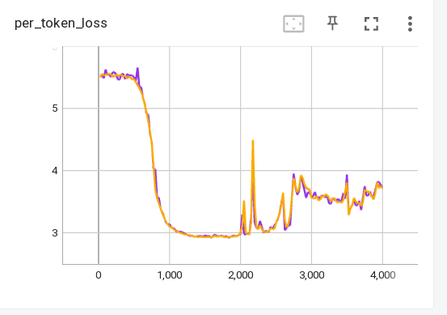

# experiment 4.1


## TLDR

hypotheses - trying to use deepspeed from july-19-22 - around time when we trained BLOOM but also trying grad clip of 2.0

**Success!** This run finished a 20h run - no problems whatsoever - so we definitely have a solid setup with deepspeed-v0.6.7 but with a bug fix cherry-picked commit added to it.

The loss was having issues as it's the case right, now but the purpose of this experiment was to find a non-crashing setup and not deal with loss.



The training run for 5k iterations over 20h (and a few hours in another run before that, was just configured to run for 6h)


### Setup

```
cd /gpfsdswork/projects/rech/cnw/commun/experiments/stas/m4-full
bash experiments/pretraining/vloom/tr_141_cm409xPMD01_scale_leap_of_faith_v5_num_workers_04/01_launch.sh

cd /gpfsssd/scratch/rech/cnw/commun/experiments/local_experiment_dir/tr_141_cm409xPMD01_scale_leap_of_faith_v5_num_workers_04/logs
tail -f main_log.txt
```


(also weirdly chose to do grad_clip: 2.0 - probably tried 1.0 and made a mistake - let's see though)

- m4@main - no code tweaks: 4a5d063212acb6f255fa91bbf824ae5fbf89bbab / Tue Jan 17 22:46:56 2023 +0100
- conda env stas-m4
- install deepspeed==0.6.7 plus fix (see below)
- pt-1.12
- grad_clip: 2.0
- CUDA_LAUNCH_BLOCKING=1
- num_workers=2
- normal accumulation (really using m4@main)


Using Deepspeed==v0.6.7 plus this [fix](https://github.com/microsoft/DeepSpeed/pull/2642)
```
commit 78a13fbf5b0ebc25b4d47c26c9ed8d9ac02d5eae (HEAD)
Author: Samyam Rajbhandari <samyamr@microsoft.com>
Date:   Thu Dec 22 16:50:45 2022 -0800

    [zero-3] Handle forward parameter return correctly in nested cases (#2642)

    Co-authored-by: Stas Bekman <stas00@users.noreply.github.com>
    Co-authored-by: Olatunji Ruwase <olruwase@microsoft.com>
    Co-authored-by: Jeff Rasley <jerasley@microsoft.com>
```

So specifically did:
```
source $cnw_ALL_CCFRWORK/start-m4-user
conda activate stas-m4
git clone https://github.com/microsoft/DeepSpeed DeepSpeed-v0.6.7
cd DeepSpeed-v0.6.7
pip install -e .
git checkout v0.6.7
git cherry-pick a298a43af22b9f971ff63e414887e659980889d9
```

### Investigation

There was no need to investigate

last log before finishing was:
```
iteration:  4875/500000   0% | elapsed time: 19:29:30 | per_token_loss: 3.3900 | lr: 9.942E-06 | num_tokens: 1536772503 | num_images: 51264707 | num_padding: 763497 | fwd_bwd_time: 80734.8 | fwd_bwd_time_no_acc: 17.7 | image_to_text_ratio: 0.0339 | num_batches: 4875 | num_batches_in_curr_epoch: 1285 | num_batches_since_training_logged: 25 | num_epochs: 2 | num_opt_steps: 4875 | z_loss: 26.2100 | per_example_loss: 16686.1 | pixel_values_sum: 3.00775E+12 | tflop_counter: 1.977E+08 | tflop_counter_no_acc: 4.055E+04 | tflops_fwd_bwd: 2.448E+03 | tflops_fwd_bwd_no_acc: 2.289E+03 | global_batch_size_current: 4096 |
```
